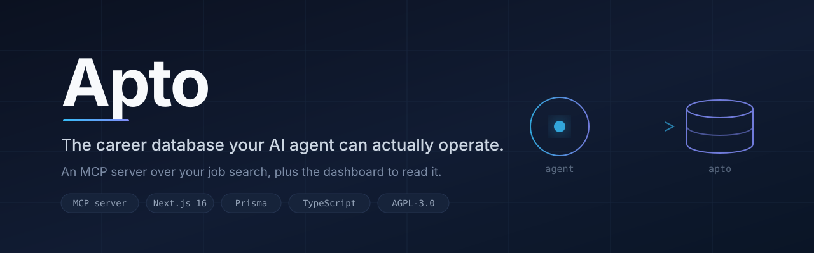

<div align="center">



<br>

**The career database your AI agent can actually operate.**

Apto is an MCP server over your job search, with a dashboard on top.
Your assistant reads the pipeline, imports candidates, records analysis and files outcomes through a typed tool layer. You keep the UI for the parts humans are better at.

[](https://www.gnu.org/licenses/agpl-3.0)
[](https://nextjs.org)
[](https://www.typescriptlang.org)
[](https://www.prisma.io)
[](https://modelcontextprotocol.io)
[](./CONTRIBUTING.md)

[Why it exists](#why-it-exists) · [Quick start](#quick-start) · [The agent layer](#the-agent-layer) · [Architecture](#architecture) · [Deploy](#deploy) · [Contributing](#contributing)

</div>

---

## Why it exists

Most job-search tools are built for you to look at. Apto is built for an agent to work in.

A long search generates more state than a person can hold: which postings are still open, which were already applied to, which follow-up dates have passed, which skill keeps appearing in the requirements you miss. That state is exactly what an LLM session forgets between conversations, and exactly what a spreadsheet cannot enforce.

So the primary interface is a set of typed tools. A Claude session can open a rotation, pull the ranked queue, import candidates with deduplication, attach a job-description analysis, and file an application, all against a real database with real constraints. The web dashboard is the read surface and the manual-edit surface, not the main event.

**What that buys you**

- **Continuity.** Session two knows what session one did, because it went into Postgres and not into a context window.
- **Constraints that hold.** Importing is not applying. Only an explicit `apto_record_application` sets `appliedAt`, so an agent cannot inflate your numbers by being enthusiastic.
- **Deduplication at the boundary.** Candidates merge on title and company, so re-running a source rotation does not produce three copies of the same posting.
- **An audit trail.** Every status change and note is a row with a timestamp, not a paragraph in a chat log.

## Quick start

**Requirements:** Node 20+, npm, and a PostgreSQL database. A free Neon database works.

```bash
git clone https://github.com/billpzt/apto-mcp.git
cd apto-mcp
npm install
cp .env.example .env
```

Open `.env` and set:
- `DATABASE_URL` to your PostgreSQL pooled connection string (with `connect_timeout=15`)
- `DIRECT_URL` to the unpooled endpoint (used for migrations only)
- At least one AI provider key (e.g. `ANTHROPIC_API_KEY`)

Then:

```bash
npm run db:push               # applies schema to your PostgreSQL database
npm run db:seed               # loads the fictional demo pipeline
npm run dev                   # http://localhost:3000
```

You should land on a Kanban board with a demo pipeline in it. The seed data is invented. Delete it whenever you want with `npm run db:reset`.

> **Note on Prisma.** Keep the CLI pinned to `prisma@^6`. Version 7 removes the `url =` syntax this schema uses and will fail to generate.
>
> **Env files.** Prisma CLI reads `.env`, not `.env.local`. Make sure both `DATABASE_URL` and `DIRECT_URL` are set there before running `npm run db:push`.
> `.env` also takes precedence over shell variables, so prefixing a command with `DATABASE_URL=...` does not override it. Edit `.env` itself, or you may run a migration against the wrong database.

## The agent layer

This is the part worth reading the source for.

Apto exposes twelve tools. They are defined once in `lib/assistant-tools.ts` and served two ways: over HTTP at `/api/mcp` for hosted clients, and through a thin stdio bridge in `apto-mcp/` for local ones.

| Tool | What it does | Notes |
|---|---|---|
| `apto_get_daily_context` | Reads the deadline, today's progress, the ranked queue, open follow-ups, skills and resume context | One call, the whole picture |
| `apto_import_job_candidates` | Validates and idempotently imports candidates | Merges on title and company. **Importing is not applying** |
| `apto_record_job_analysis` | Persists a structured analysis of a job description | Stored as JSON on the job |
| `apto_record_application` | Marks a job applied and sets the follow-up clock | The only path to `appliedAt` |
| `apto_add_job_update` | Appends a timestamped event to a job's timeline | Notes never overwrite |
| `apto_close_job` | Moves a job to a terminal status | Restricted to `CLOSED`, `REJECTED`, `WITHDRAWN`, `STALLED` |
| `apto_close_action` | Resolves an open action item | Appends notes rather than replacing them |
| `apto_record_learning` | Records a practice session against a skill | Feeds the gap analysis |
| `apto_list_jobs` | Retrieves jobs matching optional filters | Supports status, pagination, sorting |
| `apto_add_job` | Creates a new job in the database | Returns the created job record |
| `apto_update_job` | Updates an existing job | Partial updates, returns the modified record |
| `apto_delete_jobs` | Permanently removes one or more jobs | Irreversible; use with caution |

### Connecting a client

Point any MCP client at the stdio bridge:

```json
{
  "mcpServers": {
    "apto": {
      "command": "node",
      "args": ["/absolute/path/to/apto/apto-mcp/index.js"],
      "env": {
        "APTO_BASE_URL": "http://localhost:3000",
        "APTO_API_KEY": "the key from your .env.local"
      }
    }
  }
}
```

`APTO_BASE_URL` has no default. Set it to your own instance, local or deployed.

### Two design decisions worth stealing

**Writes are never retried.** `aptoFetch` retries once on transport failures and 5xx, but only for reads. A write that timed out may still have landed, and a blind retry turns one application into two. Failed writes return a hint telling the caller to check before resending. This exists because an earlier version did retry, and produced a duplicate submission to a company that had already seen the candidate.

**Recording a note is not changing state.** Both `apto_close_job` and `apto_close_action` exist because the first version only had `apto_add_job_update`, which wrote a note and left `status` untouched. Dead jobs kept resurfacing in the ranked queue, because the queue filters on status and the status had never moved. If your agent can describe something but not change it, it will describe it forever.

## Architecture

```
apto/
├── app/
│   ├── jobs/            Kanban board, the main surface
│   ├── skills/          Skills, practice log, gap analysis
│   ├── insights/        Funnel and frequency charts
│   ├── platforms/       Directory of passive profiles
│   └── api/
│       ├── mcp/         MCP transport over HTTP
│       └── jobs/        REST, accepts x-api-key or session cookie
├── lib/
│   ├── assistant-tools.ts     Tool schemas, single source of truth
│   ├── assistant-service.ts   The functions those tools call
│   ├── daily-search.ts        Ranking for the queue
│   └── job-import.ts          Validation and merge on import
├── apto-mcp/            Stdio MCP bridge. No database code, HTTP client only
└── prisma/              Schema and the fictional demo seed
```

**Stack:** Next.js 16 (App Router), TypeScript, Tailwind CSS v4, Prisma, PostgreSQL, `lucide-react`.

**AI providers:** DeepSeek, Z.ai GLM, OpenRouter and Anthropic are all supported. Set whichever keys you have and pick a default in Settings.

**A note on the MCP bridge.** `apto-mcp/index.js` contains no database code at all. It reads `APTO_API_KEY` and calls `APTO_BASE_URL` over HTTP. Prisma runs in the Next.js app. If a tool reports that it cannot reach the database, that error came from the deployed app's environment, not from the bridge, so editing the bridge's environment will not fix it.

## Deploy

Apto runs on any Node host. The reference deployment is Vercel plus a serverless Postgres.

1. Create the database and copy both connection strings.
2. Set the environment variables from `.env.example` in your host's dashboard, not in a committed file.
3. `DATABASE_URL` should be the **pooled** endpoint with `connect_timeout=15`. `DIRECT_URL` should be the **unpooled** one, for migrations only.
4. Deploy, then apply the schema.

> **Why `connect_timeout` matters.** Serverless Postgres scales compute to zero when idle. The first query after that has to wake it, which can take several seconds, while Prisma's default connect timeout is five. The race produces an error that reads like an outage but is a timeout, and the tell is that retrying a minute later works. Raising the timeout on the pooled URL fixes it.

> **Do not run `db:push` against a shared database.** Prisma will offer to drop tables it does not know about. Use `prisma db execute` with targeted SQL instead.

## Roadmap

- [ ] Cover letter generator with a house-style module rather than a bare prompt
- [ ] Resume tailoring against a specific job description
- [ ] Fit-weighted gap heatmap across the whole pipeline
- [ ] Multi-user authentication
- [ ] Public shareable profile at `/p/[username]`

## Contributing

Contributions are welcome, including bug reports and questions. See [CONTRIBUTING.md](./CONTRIBUTING.md).

The single rule worth stating up front: this project holds someone's job search, so anything that could quietly change an application's state needs to be explicit, reversible and logged.

## License

[AGPL-3.0](./LICENSE). You can use, modify and self-host this freely. If you run a modified version as a network service, you have to publish your changes.

Copyright holder: Bill Piazzetta. Commercial licensing enquiries are welcome.

## Acknowledgements

Built in the open while job hunting, which is also how most of its constraints were discovered.
